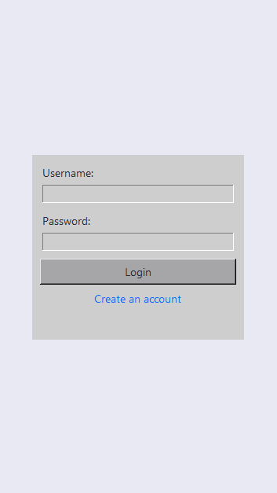

# Tkinter Login
A Python GUI program built using the tkinter library with a client-server architecture for user authentication and registration using SQLite for database management.

## Screenshots
 

## Dependencies
* tkinter
* sqlite3
* socket
* threading
* hashlib

## Installation
**1. Clone the repository**
```bash
git clone https://github.com/PouyaMT/tkinter-login.git
```

**2. Run  server.py**
```bash
python server.py
```

**3. Run  client.py**
```bash
python client.py
```
